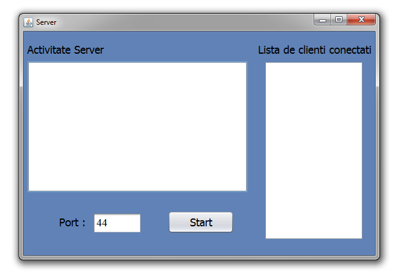
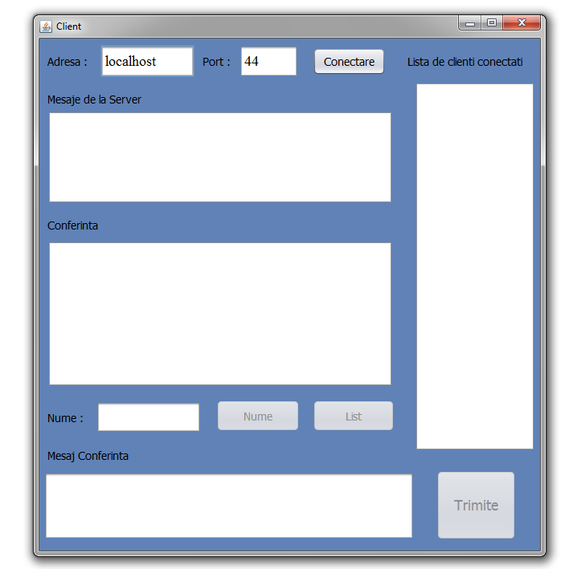
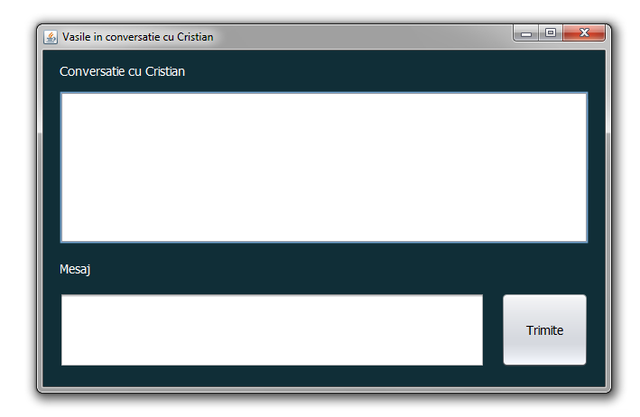

# Chat cu GUI in Java

## Introducere

Aceasta aplicatie are o arhitectura de tip client-server si ofera utilizatorilor posibilitatea conversatiilor in timp real, de tip text. Utilizatorii vor putea :

* sa se conecteze la server;
* sa isi aleaga un nume;
* sa comunice direct cu un alt utilizator;
* sa transmita un mesaj catre toti utilizatorii.

## Server GUI

### Detalii

Serverul se conecteaza la un port dat de utilizator( default este "44" ) si asteapta utilizatori. Aceasta afiseaza mesaje specifice cand un client se conecteaza, isi schimba numele sau se deconecteaza si o lista cu toti utilizatorii conectati. Daca serverul este oprit atunci toti clienti sunt deconectati.

## Client GUI

### Detalii

Clientul se conecteaza la server cu adresa si portul date de utilizator( default sunt "localhost" pentru adresa si "44" pentru port ) si isi alege un nume. Utilizatorul are la dispozitie : 

* sa isi schimbe numele cu butonul "Nume";
* sa primeasca lista de utilizatori de la server cu butonul "List";
* sa trimita un mesaj catre toti utilizatorii, scris in casuta "Mesaj Conferinta", apasand ENTER sau butonul "Trimite";
* sa comunice cu un alt utilizator prin dublu-click pe numele acestuia din lista de clienti. Aceasta actiune va deschide o fereastra prin care poate comunica numai cu acel utilizator;
* sa se deconecteze de la server.

Utilizatorul va primii mesaje de la sever sau clienti in casutele corespunzatoare.

## Mesaj privat GUI

### Detalii

Utilizatorul va putea trimite mesaje catre un alt utilizator apasand ENTER sau butonul "Trimite" si va primii mesaje de la acesta sau de la server in cazul in care acesta s-a deconectat.

